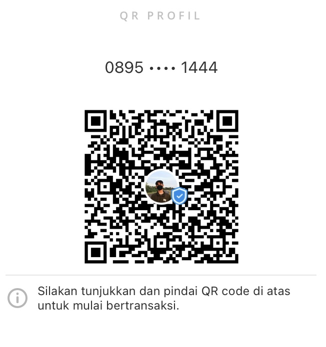

<!DOCTYPE html>
<html lang="id">
<head>
  <meta charset="UTF-8" />
  <meta name="viewport" content="width=device-width, initial-scale=1.0"/>
  <title>HB Barbershop</title>
  
</head>
<body>
  <header>
    
    <h1>HB Barbershop</h1>
    
Potongan Rapi, Gaya Pasti

  </header>

  

    <h2>Reservasi (Slot Waktu)</h2>
    <form id="bookingForm">
      <input type="text" id="nama" placeholder="Nama Lengkap" required /> 
      <input type="date" id="tanggal" required /> 
      <select id="slotWaktu" required></select> 
      <label><input type="radio" name="metode" value="QRIS DANA" checked /> QRIS DANA</label>
      <label><input type="radio" name="metode" value="Bayar di Tempat" /> Bayar di Tempat</label> 
      <button type="submit">Mulai Reservasi</button>
    </form>
    

  

  

    <h3>QR Pembayaran (QRIS DANA)</h3>
    
    
Silakan pindai QR untuk pembayaran via DANA

  

  

    <h3>Riwayat Reservasi</h3>
    

      
Belum ada reservasi.

    

  

  
</body>
</html>
